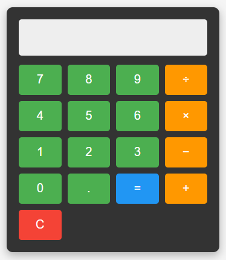

# Calculadora-JS

Uma calculadora web simples construída com HTML, CSS e JavaScript.

## Funcionalidades

- Operações aritméticas básicas (adição, subtração, multiplicação, divisão)
- Botões de limpar (C)
- Design prático
- Tratamento de erros para operações inválidas

## Tecnologias Utilizadas

- HTML5
- CSS3
- JavaScript (ES6)
